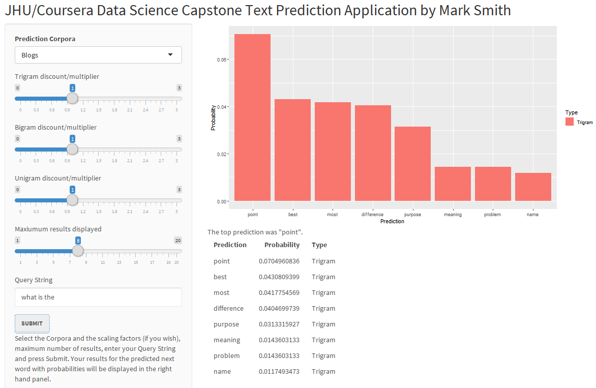

Text Prediction System Pitch
========================================================
author: Mark Smith
date: 2nd December 2018
autosize: true

Prepared for the Coursera / John Hopkins University Data Science Specialization Capstone Project

Data for testing and training was graciously provided by SwiftKey.

The accompanying application is available at https://marksmithau.shinyapps.io/CapstonePredictionApplication/

Why?
========================================================

- Prediction of the next word has many useful applications in the modern world:
- Text entry systems such as SwiftKey allow faster, more accurate text input.
- Search systems can try to provide faster and more specific results by predicting the next word that will be enterted.
- Speech recognition is greatly enhanced by having a set of next possible words to select candidates from to improve accuracy.
- These systems are becoming more ubiquitous (Google Assistant & Home, Amazon Alexa, Apple Siri, Microsoft Cortana) which increases the need for accurate prediction systems to improve the user experience.

Algorithm
========================================================

- Initially the input is processed by removing all hastags, email addresses, URLs, numbers and punctuation (except periods).
- Maximum likelihood estimate probablilty is calculated for all-ngrams and then Good-Turing discounting is calculated
- The {2,3,4}-grams are then filtered by the number of occurences to reduce the prediction set size (due to the target platform's resource limitations).  
- A Katz Backoff model is then implemented in the online system using the preprocessed data from the previous steps.
- Different corpuses are handled separately as the initial investigation showed that there were significant differences in predictions depending on the corpora.

Prediction Results
========================================================

- The algorithm frequently returns a 'reasonable' sounding result, although it isn't always correct.
- It is heavily constrained by the resources available so only higher frequency predictiors were kept.
- For the {2,3,4}grams, (5M, 10M, 19M) respectively were generated for the news & blogs corpora, but around 30% less for Twitter.
- Approximately 1% +- 0.3% were retained as the top match when ignoring weights/counts i.e. considering the count of each ngram as 1.
- Approximately (14%, 14%, 7%) +- 1% were retained as the top match when considering the maximum likelihood (i.e. weighted by frequency).
- The in-training-set percentage of a correct top probability match is approximately (14%, 14%, 7%).

User Guide
========================================================
left: 70%

- Go to <https://marksmithau.shinyapps.io/CapstonePredictionApplication/>, choose the parameters, enter the query string and then select Submit to see your results.
- The discounts/multipliers are in addition to the backed-off probability and should be considered an optional adjustment.

Further Information
- Detailed report: http://rpubs.com/MarkSmithAU/CapstoneReport
- Source: https://github.com/MarkSmithAU/DataScienceCapstone

***

